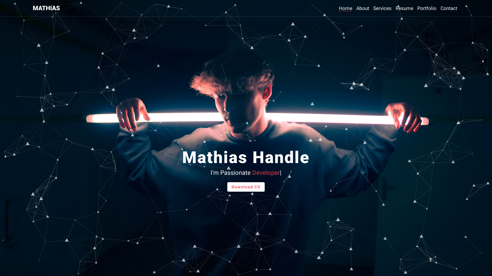

# PortfolioSite

Mockup portfolio site using vanilla JS and third party libraries.

https://mathiashandle.netlify.app/

# Disclaimer

Names, adresses and other contact informations are fictional!

# Used libraries

[particles.js](https://vincentgarreau.com/particles.js/)

[smooth-scroll](https://github.com/cferdinandi/smooth-scroll)

[lightbox](https://lokeshdhakar.com/projects/lightbox2/)

# Author

    Mathias Handle

# License

Free to use and share.
